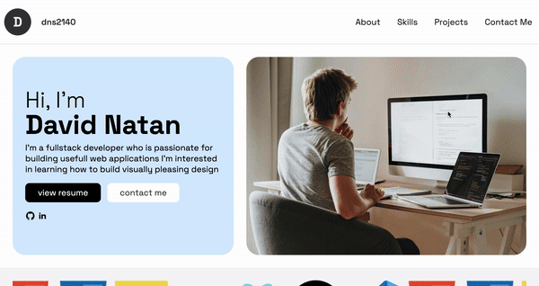

##Overview

This project showcases my personal portfolio, designed to provide insights into my skills, work experience, and projects as a full-stack developer. The website is fully responsive, optimized for different devices, and implements modern web technologies. It serves as a hub for potential employers and collaborators to learn more about me, view my resume, and get in touch.

##Technologies Used

HTML5: Structure and content.  
CSS3: Styling and layout.  
JavaScript (Vanilla): Interactivity and form handling.  
Responsive Design: Mobile-first approach with a focus on performance and accessibility.  
Web Fonts: Google Fonts (Inter and Space Grotesk) for modern and clean typography.

##Features

1. Responsive Design  
   The website is fully responsive, providing an optimal viewing experience on desktops, tablets, and mobile devices.

2. Dynamic Menu  
   A mobile-friendly navigation bar that toggles visibility for a cleaner, minimalist user interface on smaller screens.

3. Interactive Form Handling  
   JavaScript form-handling that allows dynamic updates to the front-end/back-end skills list and work experience sections. The form also uses simple validation to ensure all fields are correctly filled before submission.

4. Professional Experience Section  
   Showcases my career journey, including previous roles such as teaching staff at Ruangguru (2019-2024). The work experience section dynamically adds new entries via form submission.

5. Project Section  
   A section dedicated to some of my key projects, such as:
